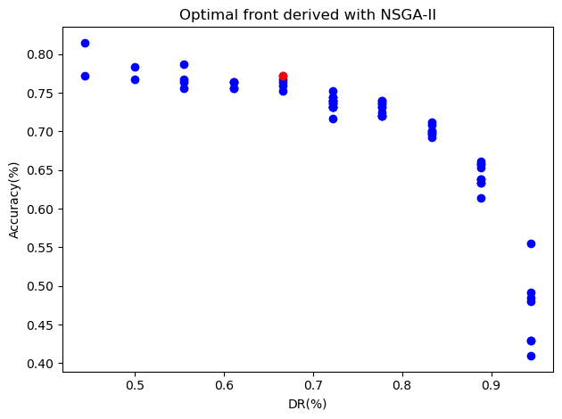

# Feature Selection with NSGA-II Algorithm

This is the implementation of NSGA-II Algorithm for the feature selection task.

Our implementation contains follow features:

- Visualization of the result
- Parallel execution for the algorithm.
- Detailed result compared to the baseline.

## Getting Started

This repo is mainly used as a reference for anyone who are doing feature selection, and most of the modules are implemented through scikit-learn or its communities.

To run the demos or use the customized function, please download the ZIP file from the repo or just copy-paste any part of the code you find helpful. They should all be very easy to understand.

Required Dependencies:

- numpy~=1.21.5
- scikit-learn~=1.1.1
- deap~=1.3.3
- pandas~=1.4.4
- tabulate~=0.8.10
- tqdm~=4.64.1
- matplotlib~=3.5.2

For convenience, you can free yourself by directly import the conda environment as follows:

```angular2html
conda env create -f environment.yaml
conda activate feature-selection
python main.py
```

## Visualization

Check the visualization of the result in "visualize.ipynb".

A typical output can be as follows:


## Parallel Execution

We employ the "deap" library and implement the parallel execution for the algorithm, which The fully utilized the multicore performance of cpu to significantly increase the speed of operation.

More details about "deap" can be checked at <https://github.com/DEAP/deap>.

## Detailed result compared to the baseline.

We compare our result with the baseline [IFSFOA](http://kns.cnki.net/kcms/detail/11.2560.TP.20171113.1413.002.html).

The details result can be seen as follows:

```angular2html
----------|Experiment Result|----------
╒═════════╤════════════╤═══════════╤════════════╤═══════════╤══════════╤══════════╤═══════════════╤══════════════╕
│ Model   │ Dataset    │   Setting │   Base Acc │   Base DR │      Acc │       DR │ Acc Compare   │ DR Compare   │
╞═════════╪════════════╪═══════════╪════════════╪═══════════╪══════════╪══════════╪═══════════════╪══════════════╡
│ 5NN     │ ionosphere │      10   │     0.9886 │    0.8765 │ 0.925714 │ 0.911765 │ -             │ +            │
├─────────┼────────────┼───────────┼────────────┼───────────┼──────────┼──────────┼───────────────┼──────────────┤
│ 3NN     │ ionosphere │      10   │     0.9942 │    0.8735 │ 0.934286 │ 0.911765 │ -             │ +            │
├─────────┼────────────┼───────────┼────────────┼───────────┼──────────┼──────────┼───────────────┼──────────────┤
│ 1NN     │ ionosphere │       0.3 │     0.9685 │    0.7911 │ 0.971429 │ 0.882353 │ +             │ +            │
├─────────┼────────────┼───────────┼────────────┼───────────┼──────────┼──────────┼───────────────┼──────────────┤
│ SVM     │ ionosphere │       2   │     0.9573 │    0.7058 │ 0.94     │ 0.882353 │ -             │ +            │
├─────────┼────────────┼───────────┼────────────┼───────────┼──────────┼──────────┼───────────────┼──────────────┤
│ J48     │ ionosphere │       0.3 │     0.9781 │    0.6029 │ 0.971429 │ 0.911765 │ -             │ +            │
├─────────┼────────────┼───────────┼────────────┼───────────┼──────────┼──────────┼───────────────┼──────────────┤
│ J48     │ ionosphere │      10   │     0.9914 │    0.7823 │ 0.942857 │ 0.852941 │ -             │ +            │
├─────────┼────────────┼───────────┼────────────┼───────────┼──────────┼──────────┼───────────────┼──────────────┤
│ 1NN     │ cleveland  │       0.3 │     0.5977 │    0.6153 │ 0.707865 │ 0.692308 │ +             │ +            │
├─────────┼────────────┼───────────┼────────────┼───────────┼──────────┼──────────┼───────────────┼──────────────┤
│ 1NN     │ srbct      │       0.3 │     0.9555 │    0.8966 │ 1        │ 0.750433 │ +             │ -            │
├─────────┼────────────┼───────────┼────────────┼───────────┼──────────┼──────────┼───────────────┼──────────────┤
│ 5NN     │ vehicle    │       0.3 │     0.7539 │    0.5    │ 0.751969 │ 0.722222 │ -             │ +            │
├─────────┼────────────┼───────────┼────────────┼───────────┼──────────┼──────────┼───────────────┼──────────────┤
│ SVM     │ vehicle    │       2   │     0.6962 │    0.75   │ 0.653269 │ 0.777778 │ -             │ +            │
├─────────┼────────────┼───────────┼────────────┼───────────┼──────────┼──────────┼───────────────┼──────────────┤
│ SVM     │ vehicle    │      10   │     0.8357 │    0.4222 │ 0.692311 │ 0.666667 │ -             │ +            │
├─────────┼────────────┼───────────┼────────────┼───────────┼──────────┼──────────┼───────────────┼──────────────┤
│ 3NN     │ heart      │      10   │     0.9185 │    0.7    │ 0.821652 │ 0.692308 │ -             │ -            │
├─────────┼────────────┼───────────┼────────────┼───────────┼──────────┼──────────┼───────────────┼──────────────┤
│ SVM     │ heart      │       2   │     0.8444 │    0.5739 │ 0.806689 │ 0.769231 │ -             │ +            │
├─────────┼────────────┼───────────┼────────────┼───────────┼──────────┼──────────┼───────────────┼──────────────┤
│ J48     │ heart      │      10   │     0.937  │    0.6153 │ 0.836467 │ 0.769231 │ -             │ +            │
├─────────┼────────────┼───────────┼────────────┼───────────┼──────────┼──────────┼───────────────┼──────────────┤
│ J48     │ arcene     │       0.3 │     0.7685 │    0.954  │ 0.916667 │ 0.5881   │ +             │ -            │
╘═════════╧════════════╧═══════════╧════════════╧═══════════╧══════════╧══════════╧═══════════════╧══════════════╛
```

As shown in the table, we reach comparable result with baseline and produce improvements in several experiments.

# Conclusions

Hope you find this repository useful.

If you encounter any questions, please contact me at <rosenberg371@outlook.com>.