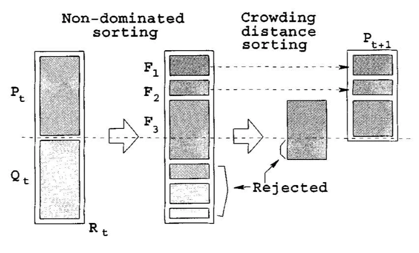

# Feature Selection with NSGA-II Algorithm

This is the implementation of NSGA-II Algorithm for the feature selection task.

Our implementation contains follow features:

- Visualization of the result
- Parallel execution for the algorithm.
- Detailed result compared to the baseline.

## Getting Started

This repo is mainly used as a reference for anyone who are doing feature selection, and most of the modules are implemented through scikit-learn or its communities.

To run the demos or use the customized function, please download the ZIP file from the repo or just copy-paste any part of the code you find helpful. They should all be very easy to understand.

Required Dependencies:

- numpy~=1.21.5
- scikit-learn~=1.1.1
- deap~=1.3.3
- pandas~=1.4.4
- tabulate~=0.8.10
- tqdm~=4.64.1
- matplotlib~=3.5.2

For convenience, you can free yourself by directly import the conda environment as follows:

```angular2html
conda env create -f environment.yaml
conda activate feature-selection
python main.py
```

## Feature Selection

Based on the different strategies of searching, feature selection can also be classified into three methods, i.e., filter methods, wrapper methods and embedded methods.

- Filter methods select the most discriminative features through the character of data.
  Generally, filter methods perform feature selection before classification and clustering tasks and usually fall into a two-step strategy.
- Wrapper methods use the intended learning algorithm itself to evaluate the features. Typically, NSGA-II for feature selection is a wrapper method.
- Embedded models perform feature selection in the process of model construction.

Following figure shows the classification of feature selection methods:


## NSGA-II Algorithm

[NSGA-II](https://pdfs.semanticscholar.org/df2b/c681c725f89218dbabdd53780b42be754c4a.pdf) algorithm is a fast and elitist multi-objective genetic algorithm.
The procedure of genetic algorithm can be shown as follows:


NSGA-II does the elitism select individuals through fast non-dominated sort and crowding distance assignment:



Fast non-dominated sorting is the process of decomposing the solution set into Pareto fronts of different orders:


In NSGA II, in order to measure the quality of individual solutions in the same frontier, the authors assign a crowding distance to each solution. The idea behind this is to make the obtained
Pareto-optimal solutions as dispersed as possible in the objective space. It is also more likely that the solutions will be uniformly distributed over the Pareto optimal frontier:


Detailed description can be found in the original paper or [here](https://www.jianshu.com/p/0b9da31f9ba3).

To apply NSGA-II to feature selection, we used binary individual coding and employed uniform crossover and bit-flipping mutations.

An example for uniform crossover procedure looks like this:


The specific hyperparameter settings can be viewed in the [model.py](model.py) file.

## Features

### Visualization

Check the visualization of the result in [visualize.ipynb](visualize.ipynb).

A typical output can be as follows:


where blue points indicate the individual generated in the final round and red one specify the chosen one.

### Parallel Execution

We employ the "deap" library and implement the parallel execution for the algorithm, which The fully utilized the multicore performance of cpu to significantly increase the speed of operation.

More details about "deap" can be checked at <https://github.com/DEAP/deap>.

### Detailed result compared to the baseline.

We compare our result with the baseline [IFSFOA](http://kns.cnki.net/kcms/detail/11.2560.TP.20171113.1413.002.html).

The details result generated from [main.py](main.py) can be seen as follows:

```angular2html
----------|Experiment Result|----------
╒═════════╤════════════╤═══════════╤════════════════╤═══════════════╤══════════╤══════════╤═══════════════╤══════════════╕
│ Model   │ Dataset    │   Setting │   Baseline Acc │   Baseline DR │      Acc │       DR │ Acc Compare   │ DR Compare   │
╞═════════╪════════════╪═══════════╪════════════════╪═══════════════╪══════════╪══════════╪═══════════════╪══════════════╡
│ 5NN     │ ionosphere │      10   │         0.9886 │        0.8765 │ 0.922857 │ 0.911765 │ -             │ +            │
├─────────┼────────────┼───────────┼────────────────┼───────────────┼──────────┼──────────┼───────────────┼──────────────┤
│ 3NN     │ ionosphere │      10   │         0.9942 │        0.8735 │ 0.928571 │ 0.911765 │ -             │ +            │
├─────────┼────────────┼───────────┼────────────────┼───────────────┼──────────┼──────────┼───────────────┼──────────────┤
│ 1NN     │ ionosphere │       0.3 │         0.9685 │        0.7911 │ 0.980952 │ 0.882353 │ +             │ +            │
├─────────┼────────────┼───────────┼────────────────┼───────────────┼──────────┼──────────┼───────────────┼──────────────┤
│ SVM     │ ionosphere │       2   │         0.9573 │        0.7058 │ 0.94     │ 0.882353 │ -             │ +            │
├─────────┼────────────┼───────────┼────────────────┼───────────────┼──────────┼──────────┼───────────────┼──────────────┤
│ J48     │ ionosphere │       0.3 │         0.9781 │        0.6029 │ 0.980952 │ 0.882353 │ +             │ +            │
├─────────┼────────────┼───────────┼────────────────┼───────────────┼──────────┼──────────┼───────────────┼──────────────┤
│ J48     │ ionosphere │      10   │         0.9914 │        0.7823 │ 0.942857 │ 0.852941 │ -             │ +            │
├─────────┼────────────┼───────────┼────────────────┼───────────────┼──────────┼──────────┼───────────────┼──────────────┤
│ 1NN     │ cleveland  │       0.3 │         0.5977 │        0.6153 │ 0.651685 │ 0.769231 │ +             │ +            │
├─────────┼────────────┼───────────┼────────────────┼───────────────┼──────────┼──────────┼───────────────┼──────────────┤
│ 1NN     │ srbct      │       0.3 │         0.9555 │        0.8966 │ 1        │ 0.908579 │ +             │ +            │
├─────────┼────────────┼───────────┼────────────────┼───────────────┼──────────┼──────────┼───────────────┼──────────────┤
│ 5NN     │ vehicle    │       0.3 │         0.7539 │        0.5    │ 0.755906 │ 0.777778 │ +             │ +            │
├─────────┼────────────┼───────────┼────────────────┼───────────────┼──────────┼──────────┼───────────────┼──────────────┤
│ SVM     │ vehicle    │       2   │         0.6962 │        0.75   │ 0.653269 │ 0.777778 │ -             │ +            │
├─────────┼────────────┼───────────┼────────────────┼───────────────┼──────────┼──────────┼───────────────┼──────────────┤
│ SVM     │ vehicle    │      10   │         0.8357 │        0.4222 │ 0.654356 │ 0.833333 │ -             │ +            │
├─────────┼────────────┼───────────┼────────────────┼───────────────┼──────────┼──────────┼───────────────┼──────────────┤
│ 3NN     │ heart      │      10   │         0.9185 │        0.7    │ 0.803134 │ 0.769231 │ -             │ +            │
├─────────┼────────────┼───────────┼────────────────┼───────────────┼──────────┼──────────┼───────────────┼──────────────┤
│ SVM     │ heart      │       2   │         0.8444 │        0.5739 │ 0.765782 │ 0.923077 │ -             │ +            │
├─────────┼────────────┼───────────┼────────────────┼───────────────┼──────────┼──────────┼───────────────┼──────────────┤
│ J48     │ heart      │      10   │         0.937  │        0.6153 │ 0.836467 │ 0.769231 │ -             │ +            │
├─────────┼────────────┼───────────┼────────────────┼───────────────┼──────────┼──────────┼───────────────┼──────────────┤
│ J48     │ arcene     │       0.3 │         0.7685 │        0.954  │ 0.9      │ 0.618    │ +             │ -            │
╘═════════╧════════════╧═══════════╧════════════════╧═══════════════╧══════════╧══════════╧═══════════════╧══════════════╛
```

As shown in the table, we reach comparable result with baseline and produce improvements in several experiments.

## Words in the End

Finally, many thanks to [ChaoesLuol](https://www.jianshu.com/u/bb3bf400a76c) for completing a series of articles with sample code that provided great help in the completion of this library, and we
list his articles below for reference:

- <https://www.jianshu.com/p/8fa044ed9267>
- <https://www.jianshu.com/p/3cbf5df95597>
- <https://www.jianshu.com/p/4873e16fa05a>
- <https://www.jianshu.com/p/a15d06645767>
- <https://www.jianshu.com/p/8e16fe258337>
- <https://www.jianshu.com/p/0b9da31f9ba3>

Hope you find this repository useful.

If you encounter any questions, please contact me at <rosenberg371@outlook.com>.